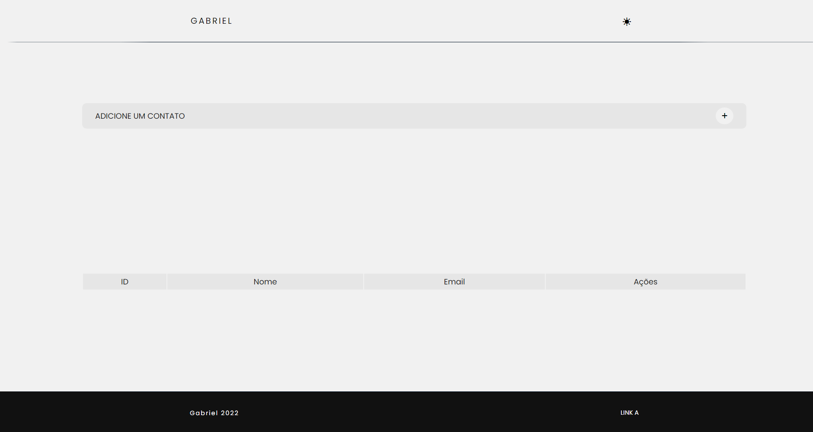
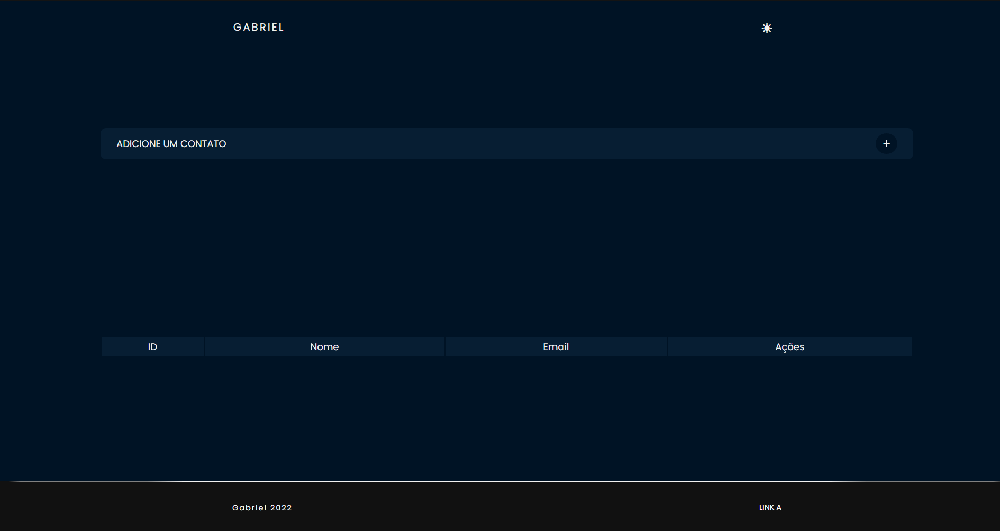

<h1>CRUD</h1>

Esse projeto é um CRUD, acrônimo para Create, Read, Update e Delete.
Foi usado a ferramenta [Vite](https://vitejs.dev) e o [ReactJS](https://pt-br.reactjs.org) para a criação do projeto.

<h2>Imagens:</h2>


<h2></h2>



<h2>Funcionalidades</h2>

- Tema dark e light.
- Todas as funcionalidades do CRUD.
- Modal para inserir os dados.
- Validação dos dados.
- Armazenamento dos dados no LocalStorage.

<h2>Rodando o projeto:</h2>
OBS: É necessário que tenha o [NodeJS](https://nodejs.org/en/)  e o [Git](https://git-scm.com) instalados em sua máquina!

```bash 
1. Clone o repositório:
$ git clone https://github.com/gabriellima2/crud-reactjs.git

2. Acesse a pasta e instale as dependências via terminal:
$ npm install

3. Inicie a aplicação em modo de desenvolvimento:
$ npm run dev

4. O servidor será aberto em http://localhost:3000
```